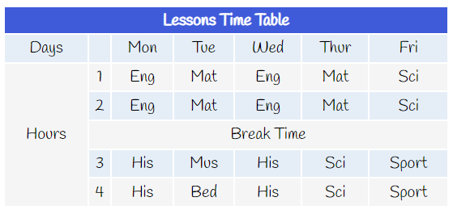

# Lesson Time Table
<h3>visit: https://aokmen.github.io/time_table/</h3>

HTML Table Example
The given code is an example of an HTML table that displays a weekly lesson time table.

HTML Structure
The code starts with the standard HTML5 <!DOCTYPE html> declaration followed by the html element containing two child elements: the head and the body elements.

The head element contains various metadata such as the page title, character encoding, and viewport configuration. Additionally, it links to an external font file hosted on Google Fonts using the link tag.

In the body element, the table is defined using the table tag. The table has two primary sections: the thead and the tbody. The thead element defines the table header row, which consists of a single cell that spans across all seven columns using the colspan attribute. The tbody element contains the table body rows.

The table has a total of five rows: the first row is a header row that contains the column headings "Days," "Mon," "Tue," "Wed," "Thur," and "Fri." The following four rows contain the lesson schedule for each day of the week.

CSS Styling
The table is styled using CSS. The text alignment of the table cells is set to center using the text-align property. The background color of the even rows is set to a light blue using the background-color property and the rgba color model. The font family is set to "Handlee," with a fallback to the arial and serif font families. The font size is set to 20 pixels.

The first row of the table has a unique style. The background color is set to dark blue, and the text color is set to white using the background-color and color properties, respectively. The height of the row is also set to 30 pixels using the height attribute.

The fifth and third rows are also styled differently using the tek_satir class. The background color of these rows is set to white smoke using the background-color property. Additionally, the third row spans across all six columns using the colspan attribute.
